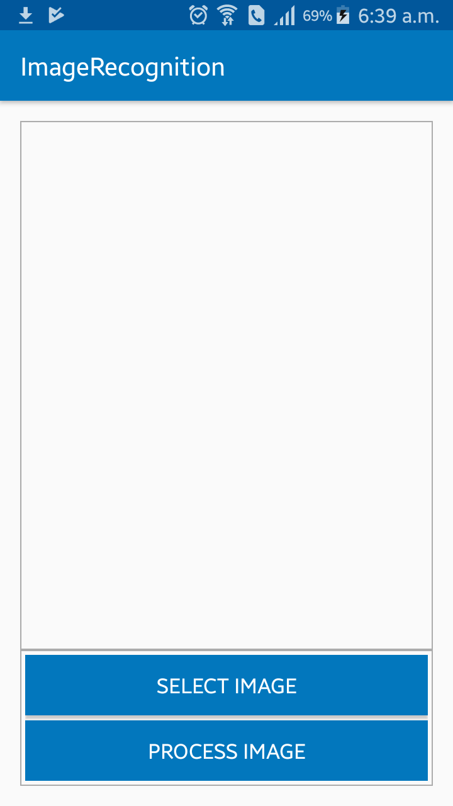
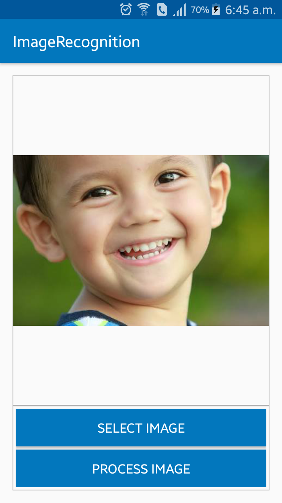
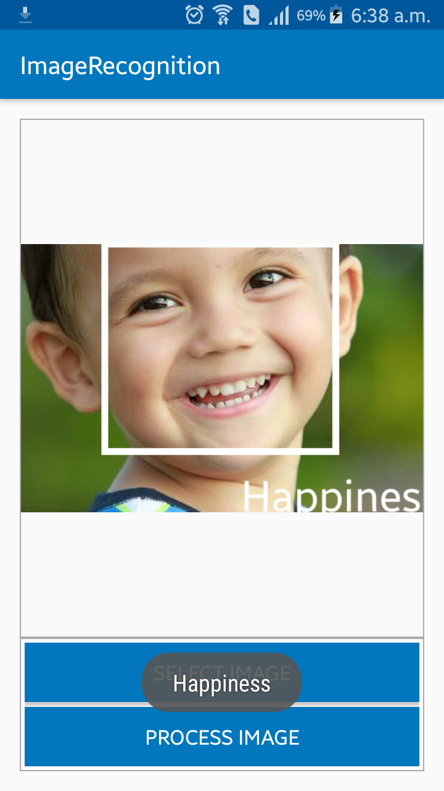

# ImageRecognition
Image Recognition is an application which identifies the facial expression of human from an image.

First user have to select an image by clicking "Select Image" button. \n 

Then user can get the expression by clicking "Process Image" button.

